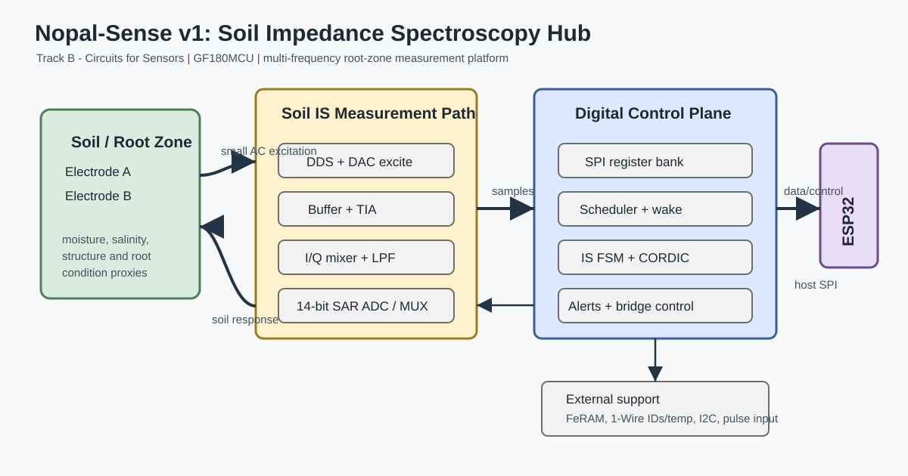

# Nopal-Sense Project Proposal

**Event:** IEEE SSCS PICO Open-Source Chipathon 2026  
**Review:** Week 24 Project Proposal Review, June 12, 2026  
**Track:** B - Circuits for Sensors  
**Secondary relevance:** D - AI/LLM-assisted design workflow, for audit and documentation support only  
**Repository:** https://github.com/Jefemaestro33/nopal-sense  
**Public issue:** https://github.com/sscs-ose/sscs-chipathon-2026/issues/16

This document is the reviewable text version of the Nopal-Sense proposal. The
slide source in this folder maps the same content to the official four-slide
Chipathon proposal template.

## 1. Team Information

**Team name:** Nopal-Sense

| Role | Name | GitHub | Notes |
|---|---|---|---|
| Design lead | Ernest Zermeño | @Jefemaestro33 | Universidad de Guadalajara; individual Track B participant |

**Contact email:** ernest@zlabstudio.com

## 2. Project Information

### Goal

Nopal-Sense aims to tape out a low-power mixed-signal soil-impedance
spectroscopy ASIC for agricultural deployments. The chip will generate
controlled multi-frequency electrical excitation through soil electrodes,
measure the soil/root-zone response, and expose calibrated data through a simple
SPI-controlled digital hub.

### High-Level Design Proposal

The differentiating block is a dedicated soil impedance spectroscopy path:
DDS-based excitation, electrode interface, TIA, I/Q mixer readout, filtering,
and a shared SAR ADC. Around that measurement path, v1 adds a SPI register bank,
low-power scheduler, alert engine, and bridge interfaces for external memory
and sensors. Digital control RTL is already integrated under `v1-pico/` with
185/185 Icarus regression assertions passing; the analog AFE, ADC/bandgap
implementation, and top-level AMS verification are the next major milestones.
The public tapeout scope is the measurement platform; long-term interpretation
belongs to off-chip firmware, field datasets, and AI models after validation.

### Application

Low-cost agricultural soil impedance spectroscopy for irrigation, salinity, and
root-zone condition tracking, enabling repeated measurements that generic
single-point soil sensors do not provide.

### Long-Term Product Vision

Nopal-Sense is intended to make constant, repeatable soil impedance spectra
cheap enough to collect at agricultural scale. A single measurement should not
be treated as a disease diagnosis; the long-term goal is to use many validated
multi-frequency measurements to build datasets and software models that can
recognize electrical patterns correlated with abnormal root-zone conditions.
After controlled biological validation, this software layer could explore
patterns associated with fungal, oomycete, or other root-zone disease pressure,
while the chip remains the low-cost spectroscopy instrument that makes the data
collection practical.

### Current Public Progress

- Public GF180MCU project repository created and synchronized with GitHub.
- Frozen public v1 specification, architecture, and 88-pin workshop-slot pin
  assignment are available in `v1-pico/`.
- 18 functional RTL modules plus top-level integration and workshop wrapper are
  in the repo.
- Current digital regression reports 185/185 Icarus assertions passing.
- P0 digital integration audit findings have been fixed in RTL.

### Remaining Milestones Before Proposal Review

- Publish the proposal deck and link it from the official Chipathon issue.
- Confirm any additional team/collaboration entries.
- Keep the public scope precise: soil/root-zone measurement hub, not plant
  tissue EIS and not immediate pathogen identification.

### Remaining Milestones After Proposal Review

- Add `bridge_controller.v` to decode trigger registers into external SPI, I2C,
  and 1-Wire transactions.
- Add ADC and sensor behavioral stubs for top-level verification.
- Expand top-level integration coverage beyond the current audited paths.
- Begin analog AFE planning for DDS/DAC, buffer, TIA, I/Q mixer, low-pass
  filtering, shared SAR ADC, and bandgap/reference.
- Prepare schematic-level review material for the July 3 Schematic Review.

### References

- IEEE SSCS Chipathon 2026 repository and participation guidelines:
  https://github.com/sscs-ose/sscs-chipathon-2026
- Nopal-Sense public repository:
  https://github.com/Jefemaestro33/nopal-sense
- Nopal-Sense v1 frozen specification:
  https://github.com/Jefemaestro33/nopal-sense/blob/main/v1-pico/SPEC_FROZEN.md
- Nopal-Sense v1 architecture:
  https://github.com/Jefemaestro33/nopal-sense/blob/main/v1-pico/ARCHITECTURE.md
- Kelleners et al., "Coil probe for in situ measurement of soil electrical
  impedance spectra", Soil Science Society of America Journal, 2009.
- Samouelian et al., "Electrical resistivity survey in soil science: a review",
  Soil and Tillage Research, 2005.

## 3. Team Background

### Academic and Technical Experience

- Ernest Zermeño has a biology background and is currently working in
  bioinformatics research involving CRISPR and experimental biology.
- Technical interests include computational biology, data analysis, embedded
  systems, and measurement tools for biological and agricultural systems.
- This background motivates the focus on practical soil/root-zone measurements
  rather than a generic sensor interface.

### Work and Application Experience

- Software and applied technology work through zlabstudio.
- Previous work includes exploring FHE-based software development and building
  practical software systems.
- Focused on turning technical ideas into usable tools, especially where
  biology, software, data, and measurement systems overlap.

## 4. Questions, Suggestions, and Doubts

1. Is the v1 scope realistic for Track B if the must-work tapeout path is
   limited to soil impedance spectroscopy AFE, shared SAR ADC, SPI register
   access, and low-power scheduling?
2. Should the ADC be a custom SAR implementation in v1, or should the design
   reuse an existing open-source/reference ADC to reduce schedule risk?
3. What electrode protection, ESD strategy, and analog pad usage are recommended
   for soil probes connected outside the chip package?
4. Are 10 kHz, 30 kHz, and 100 kHz acceptable first-tapeout frequencies for
   root-zone impedance, or should the top frequency be reduced for bring-up
   robustness?
5. What minimum AMS validation evidence is expected by the July block and
   top-level simulation reviews?
6. Can Track B mentors recommend a conservative first implementation strategy
   for the TIA, I/Q mixer, bandgap/reference, and SAR ADC blocks in GF180MCU?
