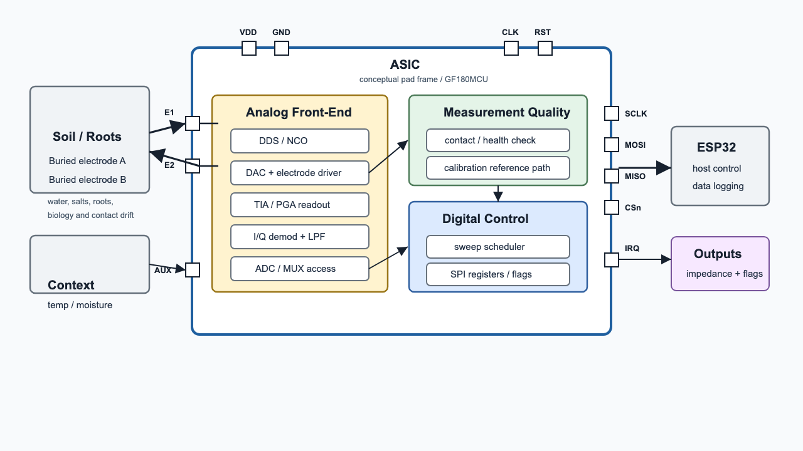

# Nopal-Sense

**Mixed-Signal Soil Impedance Spectroscopy Hub**  
IEEE SSCS PICO Open-Source Chipathon 2026  
Week 24 Project Proposal Review - June 12, 2026

**Team members:**  
Leader: Ernest Zermeño (@Jefemaestro33)  
Affiliation: Universidad de Guadalajara (individual Track B participant)

**Contact email:**  
ernest@zlabstudio.com

**Track:**  
B - Circuits for Sensors  
Secondary relevance: D - AI/LLM-assisted audit and documentation workflow

# Project Information

**Goal (2 sentences)**  
Design a low-power mixed-signal ASIC for repeatable soil/root-zone impedance spectroscopy using buried electrodes. The research goal is to generate dense, calibrated datasets to test whether root-zone electrical patterns can indicate abnormal biological activity, including fungal or oomycete-related signals.

**Design - High Level Proposal (2-3 sentences + image)**  
The chip provides programmable AC excitation, electrode-interface readout, filtering, ADC access, and SPI-configurable control. It supports autonomous low-power frequency sweeps with synchronized moisture/temperature context and electrode contact/health checks. V1 is a measurement platform for calibrated soil data, not a pathogen-diagnosis chip.

**Application (1 sentence)**  
Low-cost agricultural root-zone monitoring for irrigation, salinity, and abnormal-condition screening, with a long-term path toward validated fungal/oomycete pattern detection.

**References**  
AD5940/ADuCM355 datasheets; Bukhari et al., arXiv:2508.13379; Zhang et al., Biosensors 2025; Corona-Lopez et al., Plant Methods 2019; Settimi 2011.

# Team Background

**Academic Experience**  
Ernest Zermeño - Biology background, currently working in bioinformatics research involving CRISPR and experimental biology. Technical interests include computational biology, data analysis, embedded systems, and measurement tools for biological and agricultural systems.

**Work Experience**  
Software and applied technology work through zlabstudio. Previous work includes exploring FHE-based software development and building practical software systems, with a focus on turning technical ideas into usable tools.

# Questions, Suggestions, Doubts?

- What is the recommended must-work scope for v1 if the full architecture is too large for the tapeout schedule?
- Should v1 reuse an existing open-source/reference SAR ADC instead of a custom ADC design to reduce schedule risk?
- What electrode protection, ESD strategy, and analog pad usage are recommended for soil probes connected outside the chip package?
- What minimum AMS validation evidence is expected by the July block and top-level simulation reviews?
